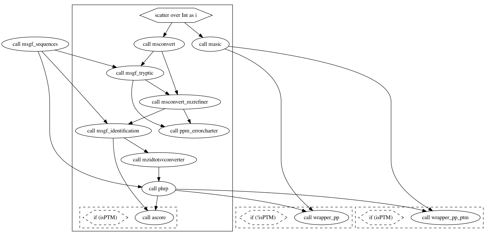

# MoTrPAC Proteomics Pipeline

***MoTrPAC Proteomics Data Analysis Pipeline***

---

# Overview

Cloud-based proteomics data analysis pipeline including two proteomics methods, MS-GF+ & MaxQuant, based 
on the pipeline language [WDL](https://openwdl.org/) and tools to orchestrate the execution (`caper`/`crownwell`).
It currently supports two quantification methods: TMT & Label-Free.

**MSGF+ workflow schema**




# Utilities

## Scripts

### `create_config_json.py`

It creates the pipeline configuration json file required to submit jobs with `caper`

- Requires Python `>3.6.9`
- Install required packages by running `pip3 install -r scripts/requirements.txt`

How to run:

```angular2html
usage: create_config_msgfplus.py [-h] -o OUTPUT_FOLDER_LOCAL -y OUTPUT_CONFIG_YAML -m QUANT_METHOD -e EXPERIMENT_PROT -g GCP_PROJECT -b BUCKET_NAME_CONFIG -p PARAMETERS_MSGF -s STUDY_DESIGN_LOCATION -q SEQUENCE_DB [-v BUCKET_NAME_RAW] -f
                                 FOLDER_RAW -d DOCKER_MSGF [-r RESULTS_PREFIX] [-x PR_RATIO]

Script to generate a proteomics configuration file from raw files in buckets

optional arguments:
  -h, --help            show this help message and exit

  -g GCP_PROJECT, --gcp_project GCP_PROJECT
                        GCP project name
  -o OUTPUT_FOLDER_LOCAL, --output_folder_local OUTPUT_FOLDER_LOCAL
                        Path to which JSON outputs should be written on your local computer
  -y OUTPUT_CONFIG_YAML, --output_config_yaml OUTPUT_CONFIG_YAML
                        File name for the JSON configuration file generated by this script
  -m QUANT_METHOD, --quant_method QUANT_METHOD
                        Quantification method: [label-free or tmt]
  -e EXPERIMENT_PROT, --experiment_prot EXPERIMENT_PROT
                        Proteomics experiment. One of the following: pr-tmt, ph-tmt, ub-tmt, ac-tmt, pr-lf, ph-lf, ub-lf, ac-lf
  -b BUCKET_NAME_CONFIG, --bucket_name_config BUCKET_NAME_CONFIG
                        Bucket name with configuration files
  -p PARAMETERS_MSGF, --parameters_msgf PARAMETERS_MSGF
                        MS-GF+ parameter FOLDER (with parameter files) location on GCP (must be relative to <bucket_name_config>)
  -s STUDY_DESIGN_LOCATION, --study_design_location STUDY_DESIGN_LOCATION
                        Proteomics study design location on GCP (relative to <bucket_name_config>)
  -q SEQUENCE_DB, --sequence_db SEQUENCE_DB
                        Sequence db file location (relative to bucket_name_config, including folder)
  -v BUCKET_NAME_RAW, --bucket_name_raw BUCKET_NAME_RAW
                        Optional: Bucket name with raw files. Required only if it is different from <bucket_name_config>
  -f FOLDER_RAW, --folder_raw FOLDER_RAW
                        Full path to the proteomics raw files on GCP, without including bucket name
  -d DOCKER_MSGF, --docker_msgf DOCKER_MSGF
                        Docker repository for MSGF+ applications
  -r RESULTS_PREFIX, --results_prefix RESULTS_PREFIX
                        Results files name prefix (which will end in _ratio.txt and _RII-peptides.txt
  -x PR_RATIO, --pr_ratio PR_RATIO
                        Optional: Global proteomics <ratio.txt> results file (for inferred PTM searches)
```

Example:

```angular2html
python3 scripts/create_config_msgfplus.py \
-g gcp-project-name \
-d gcr.io/gcp-project-name/ \
-o /Users/pepito/buckets/proteomics-pipeline/test/config/msgfplus/ \
-y test-msgfplus-ph-pi.json \
-r test-ph-pi-results \ #the output will be named: test-ph-pi-results_ratio.txt and test-ph-pi-results_rii.txt
-m tmt \
-e ph-tmt \
-b proteomics-pipeline \
-p parameters/msgfplus \ # The full path on GCP would be: gs://proteomics-pipeline/sequences_db/ID_007275_FB1B42E8.fasta \
-q sequences_db/ID_007275_FB1B42E8.fasta \ # The full path on GCP would be: gs://proteomics-pipeline/sequences_db/ID_007275_FB1B42E8.fasta \
-v proteomics-raw-folder \ # Equivalent to: gs://proteomics-raw-folder
-f test/raw/ph/ \ # The full path on GCP would be: gs://proteomics-raw-folder/test/raw/ph/
-s test/raw/ph/study_design/ \ # The full path on GCP would be:  gs://proteomics-raw-folder/test/raw/ph/study_design/
-x gs://proteomics-pipeline/test/results/pr/test-pr-results-20210907_20210916_182817_results_ratio.txt
```


### `pipeline_details.py`

It pulls the job completion time and errors (if any)

- Requires Python `>3.6.9`
- Install required packages by running `pip3 install -r scripts/requirements.txt`

How to run:

```
usage: pipeline_job_summary.py [-h] -p PROJECT -b BUCKET_ORIGIN -r RESULTS_FOLDER -i CAPER_JOB_ID

Calculate a job completion time

optional arguments:
  -h, --help            show this help message and exit
  -p PROJECT, --project PROJECT
                        GCP project name
  -b BUCKET_ORIGIN, --bucket_origin BUCKET_ORIGIN
                        Bucket with output files
  -r RESULTS_FOLDER, --results_folder RESULTS_FOLDER
                        Path to the results folder
  -i CAPER_JOB_ID, --caper_job_id CAPER_JOB_ID
                        Caper job id (E.g.: 9c6ff6fe-ce7d-4d23-ac18-9935614d6f9b)
```

Example:

```
python3 scripts/pipeline_details.py \
-p gcp-project-name \
-b proteomics-pipeline \
-r results/proteomics_msgfplus \
-c 9c6ff6fe-ce7d-4d23-ac18-9935614d6f9b
```


### `copy_pipeline_results.py`

Copy relevant pipeline outputs from cromwell folder to user's define folder

```
usage: copy_pipeline_results.py [-h] -p PROJECT -b BUCKET_ORIGIN
                                [-d BUCKET_DESTINATION_NAME] -r
                                RESULTS_LOCATION_PATH -o DEST_ROOT_FOLDER

Copy proteomics pipeline output files to a desire location

optional arguments:
  -h, --help            show this help message and exit
  -p PROJECT, --project PROJECT
                        GCP project name. Required.
  -b BUCKET_ORIGIN, --bucket_origin BUCKET_ORIGIN
                        Bucket with output files. Required.
  -d BUCKET_DESTINATION_NAME, --bucket_destination_name BUCKET_DESTINATION_NAME
                        Bucket to copy file. Not Required. Default: same as
                        bucket_origin).
  -r RESULTS_LOCATION_PATH, --results_location_path RESULTS_LOCATION_PATH
                        Path to the pipeline results. Required (e.g.
                        results/proteomics_msgfplus/9c6ff6fe-
                        ce7d-4d23-ac18-9935614d6f9b)
  -o DEST_ROOT_FOLDER, --dest_root_folder DEST_ROOT_FOLDER
                        Folder path to copy the files. Required (e.g.
                        test/results/input_test_gcp_s6-global-2files-8/)
```

(Fake) Example

Copy pipeline results to a folder `test/results/pr/pipeline-pr-20210228`

```
python scripts/copy_pipeline_results.py \
-p gcp-project-name \
-b proteomics-pipeline \
-r results/proteomics_msgfplus/9c6ff6fe-ce7d-4d23-ac18-9935614d6f9b \
-o test/results/pr/pipeline-pr-20210228
```