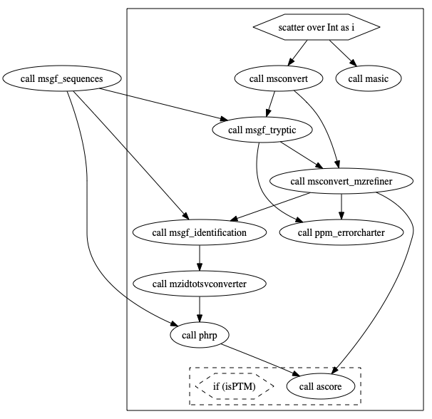

# MoTrPAC Proteomics Pipeline

***MoTrPAC Proteomics Data Analysis Pipeline***

---

# Overview

WDL implementation of a MS-GF+ based proteomics data analysis pipeline based on a pipeline language ([WDL](https://openwdl.org/)) and tools that orchestrate the execution (`caper`/`crownwell`). A prototype version of this pipeline with the details of every step can be found in this [repository](https://github.com/AshleyLab/motrpac-proteomics-pnnl-prototype)

# Installations

[Follow this link](docs/readme_installations.md) for detailed instructions on the installations required to run and test the pipeline:

- Locally on Mac OS X (>10.14)
- GCP (launch locally)

# How to test it

[This section shows](docs/readme_howtorun.md)

- Proteomics raw files that can be used for testing
- Configuration files required for testing on
   + A local MAC OS X computer
   + Google Clour Plataform 
- How to run the pipeline (on the test dataset):
   + Locally (Mac OS X >= 10.4)
   + On GCP
- Expected outputs
