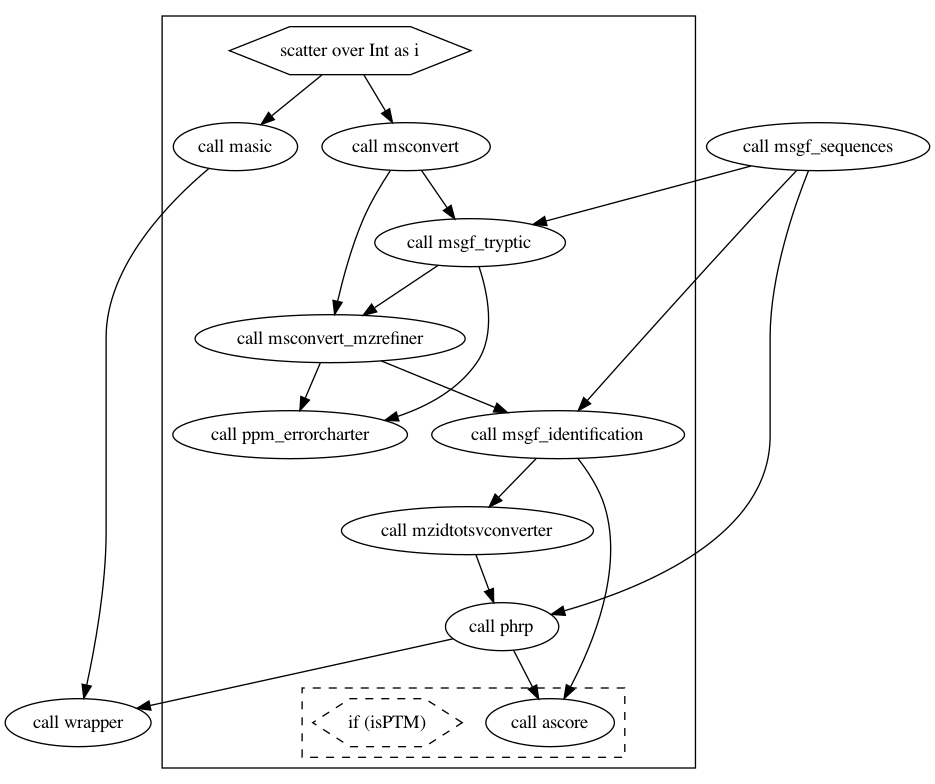

# MoTrPAC Proteomics Pipeline

***MoTrPAC Proteomics Data Analysis Pipeline***

---

# Overview

WDL implementation of a MS-GF+ based proteomics data analysis pipeline based on a pipeline language ([WDL](https://openwdl.org/)) and tools that orchestrate the execution (`caper`/`crownwell`). A prototype version of this pipeline with the details of every step can be found in this [repository](https://github.com/AshleyLab/motrpac-proteomics-pnnl-prototype)



# Installations

[Follow this link](docs/readme_installations.md) for detailed instructions on the installations required to run and test the pipeline:

- Locally on Mac OS X (>10.14)
- GCP (launch locally)

# How to test it

[Follow this link to learn](docs/readme_howtotest.md):

- Proteomics raw files that can be used for testing
- Configuration files required for testing on
   + A local MAC OS X computer
   + Google Clour Plataform 
- How to run the pipeline (on the test dataset):
   + Locally (Mac OS X >= 10.4)
   + On GCP
- Expected outputs

# Utilities

## Scripts

### `create_config_json.py`

It creates the pipeline configuration json file required to submit jobs with `caper`

- Requires Python `>3.6.9`
- Install required packages by running `pip3 install -r scripts/requirements.txt`

How to run:


(Fake) Example, for a pr experiment:

```
python scripts/create_config_json.py \
-g gcp-project-name \
-b proteomics-pipeline \ # bucket: gs://proteomics-pipeline/
-p parameters/ \ # bucket: gs://proteomics-pipeline/parameters/
-s test/raw/pr/study_design/ \ # bucket: gs://proteomics-pipeline/test/raw/pr/study_design/
-q sequences_db/ID_007275_FB1B42E8.fasta \ # bucket: gs://proteomics-pipeline/sequences_db/ID_007275_FB1B42E8.fasta 
-v proteomics-data \ # bucket: gs://proteomics-data/
-f test/raw/pr/ \ # bucket: gs://proteomics-data/test/raw/pr
-d docker.io/biodavidjm/ \
-o ~/buckets/proteomics-pipeline/test/config/ \ 
-y pipeline-pr-config.json \ 
-e pr
```

### `pipeline_details.py`

It calculates a job running time

- Requires Python `>3.6.9`
- Install required packages by running `pip3 install -r scripts/requirements.txt`

How to run:

```
usage: pipeline_details.py [-h] -p PROJECT -b BUCKET_ORIGIN -i CAPER_JOB_ID

Calculate a job completion time and pull errors (if any)

optional arguments:
  -h, --help            show this help message and exit
  -p PROJECT, --project PROJECT
                        GCP project name. Required.
  -b BUCKET_ORIGIN, --bucket_origin BUCKET_ORIGIN
                        Bucket with output files. Required.
  -i CAPER_JOB_ID, --caper_job_id CAPER_JOB_ID
                        Caper job id (E.g.: 9c6ff6fe-
                        ce7d-4d23-ac18-9935614d6f9b)
```

Example:

```
python3 scripts/pipeline_details.py \
-p gcp-project-name \
-b proteomics-pipeline \
-r results/proteomics_msgfplus \
-c 9c6ff6fe-ce7d-4d23-ac18-9935614d6f9b
```


### `copy_pipeline_results.py`

Copy pipeline output from 

```
usage: copy_pipeline_results.py [-h] -p PROJECT -b BUCKET_ORIGIN
                                [-d BUCKET_DESTINATION_NAME] -r
                                RESULTS_LOCATION_PATH -o DEST_ROOT_FOLDER

Copy proteomics pipeline output files to a desire location

optional arguments:
  -h, --help            show this help message and exit
  -p PROJECT, --project PROJECT
                        GCP project name. Required.
  -b BUCKET_ORIGIN, --bucket_origin BUCKET_ORIGIN
                        Bucket with output files. Required.
  -d BUCKET_DESTINATION_NAME, --bucket_destination_name BUCKET_DESTINATION_NAME
                        Bucket to copy file. Not Required. Default: same as
                        bucket_origin).
  -r RESULTS_LOCATION_PATH, --results_location_path RESULTS_LOCATION_PATH
                        Path to the pipeline results. Required (e.g.
                        results/proteomics_msgfplus/9c6ff6fe-
                        ce7d-4d23-ac18-9935614d6f9b)
  -o DEST_ROOT_FOLDER, --dest_root_folder DEST_ROOT_FOLDER
                        Folder path to copy the files. Required (e.g.
                        test/results/input_test_gcp_s6-global-2files-8/)
```

(Fake) Example

Copy pipeline results to a folder `test/results/pr/pipeline-pr-20210228`

```
python scripts/copy_pipeline_results.py \
-p gcp-project-name \
-b proteomics-pipeline \
-r results/proteomics_msgfplus/9c6ff6fe-ce7d-4d23-ac18-9935614d6f9b \
-o test/results/pr/pipeline-pr-20210228
```