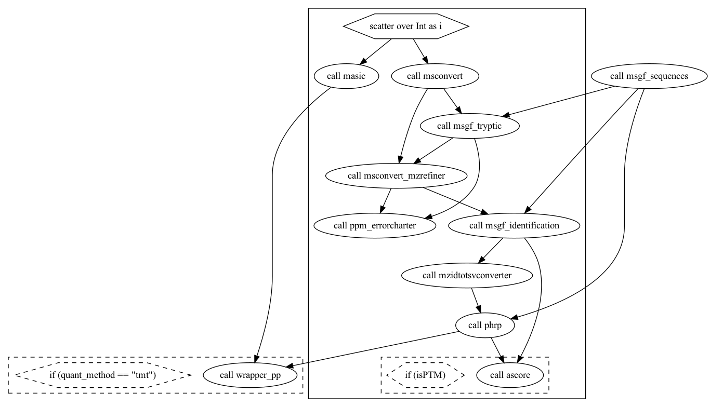

# MoTrPAC Proteomics Pipeline

***MoTrPAC Proteomics Data Analysis Pipeline***

[](https://zenodo.org/badge/latestdoi/235450808)

## Table of Contents

- [Overview](#overview)
- [Quick Start](#quick-start)
- [Prerequisites](#prerequisites)
- [GCP Set-up](#gcp-set-up)
- [Software / Dockerfiles](#software--dockerfiles)
- [Pipeline Parameters](#pipeline-parameters)
- [Configuration Files](#configuration-files)
- [Run the Pipeline](#run-the-pipeline)
- [Pipeline Outputs](#pipeline-outputs)
- [Monitoring and Job Management](#monitoring-and-job-management)
- [WDL Workflow Structure](#wdl-workflow-structure)
- [Pipeline Details](#pipeline-details)
- [Troubleshooting](#troubleshooting)
- [Utilities and Helper Scripts](#utilities-and-helper-scripts)
- [Citations and References](#citations-and-references)
- [Contributing and Support](#contributing-and-support)
- [Version Information](#version-information)
- [License](#license)

## Overview

This mass-spectrometry based-proteomics data analysis pipeline uses the programming language [WDL](https://openwdl.org/) for describing workflows. The pipeline is run using [caper](https://github.com/MoTrPAC/caper), a wrapper Python package for using the workflow management system [Cromwell](https://github.com/broadinstitute/cromwell).

### Supported Software Pipelines

Two different software/pipelines are currently supported for peptide identification and quantification:

#### 1. MS-GF+ Pipeline (Recommended)

The **MS-GF+ pipeline** is the primary pipeline used for all MoTrPAC datasets. It uses:
- [MASIC](https://github.com/PNNL-Comp-Mass-Spec/MASIC) to extract reporter ion peaks from MS2 spectra and create selected ion chromatograms for each MS/MS parent ion
- [MS-GF+](https://github.com/MSGFPlus/msgfplus) for peptide identification
- [PlexedPiper](https://github.com/PNNL-Comp-Mass-Spec/PlexedPiper) for relative quantification (TMT data)

**Key Features:**
- Processes Thermo .raw files
- Supports both label-free (LF) and TMT quantification
- In-silico mass recalibration using mzRefiner
- PTM localization with AScore (phosphorylation, acetylation, ubiquitination)
- Comprehensive quality control metrics

Details of the MS-GF+ pipeline can be found in the [MSGF+ Pipeline Details](docs/readme_msgfplus-details.md).

#### 2. MaxQuant Pipeline

[MaxQuant](https://www.maxquant.org/) is a quantitative proteomics software package designed for analyzing large mass-spectrometric data sets. Originally developed for Windows, recent updates allow [execution on Linux platforms](https://www.nature.com/articles/s41592-018-0018-y).

**Requirements:**
- Users must download MaxQuant and accept terms on their local computer
- Generate configuration file locally
- Configuration file is used to run MaxQuant on the cloud for improved performance

### Supported Experiments

The pipeline supports the following proteomics experiment types:

**TMT-based (Tandem Mass Tags):**
- `pr-tmt11` / `pr-tmt16` - Global protein abundance (11-plex or 16-plex TMT)
- `ph-tmt11` / `ph-tmt16` - Phosphoproteomics (S/T/Y phosphorylation)
- `ub-tmt11` / `ub-tmt16` - Ubiquitinomics (K ubiquitination)
- `ac-tmt11` / `ac-tmt16` - Acetylomics (K acetylation)

**Label-Free:**
- `pr-lf` - Global protein abundance (label-free)
- `ph-lf` - Phosphoproteomics (label-free)
- `ub-lf` - Ubiquitinomics (label-free)
- `ac-lf` - Acetylomics (label-free)

### Supported Species

- Rat (*Rattus norvegicus*)
- Human (*Homo sapiens*)
- Mouse (*Mus musculus*)
- Other species (with appropriate FASTA database)

## Quick Start

For experienced users, here's the essential workflow for **MS-GF+ pipeline**:

```bash
# 1. Clone the repository
git clone https://github.com/MoTrPAC/motrpac-proteomics-pipeline

# 2. Install Python dependencies
pip3 install -r scripts/requirements.txt

# 3. Upload your raw files and study design to GCS bucket
gsutil -m cp -r raw_files/*.raw gs://your-bucket/raw/
gsutil -m cp -r study_design/*.txt gs://your-bucket/study_design/

# 4. Generate input JSON configuration
python3 scripts/create_config_msgfplus.py \
  -g your-gcp-project \
  -b your-bucket \
  -p parameters/msgfplus \
  -s study_design/ \
  -q sequences_db/uniprot_rat.fasta \
  -f raw/ \
  -o ./config/ \
  -y experiment_config.json \
  -e pr-tmt11 \
  -r experiment_results \
  -d us-docker.pkg.dev/your-project/your-repo/ \
  -m tmt \
  -c "Rattus norvegicus" \
  -a RefSeq

# 5. Submit the pipeline
caper run wdl/proteomics_msgfplus.wdl -i config/experiment_config.json

# 6. Monitor pipeline status
caper list
```

## Prerequisites

### Required Accounts
- Google Cloud Platform (GCP) account with billing enabled
- GCP service account with appropriate permissions
- GCP Storage bucket for pipeline inputs and outputs

### Required Software (Local Machine)
- [Google Cloud SDK](https://cloud.google.com/sdk/docs/install)
- Python >= 3.6.9
- Git
- [gcsfuse](https://github.com/GoogleCloudPlatform/gcsfuse) (for mounting GCS buckets)

### Python Dependencies

Install required Python packages:
```bash
pip3 install -r scripts/requirements.txt
```

Key dependencies include:
- `google-cloud-storage` - GCS interaction
- `pandas` - Data manipulation
- `PyYAML` - YAML parsing
- Other standard libraries

### Required Input Files

#### 1. Raw Data Files
- **Format**: Thermo Fisher .raw files (from Orbitrap mass spectrometers)
- **Naming**: Follow consistent naming convention
- **Location**: Upload to GCS bucket

#### 2. Study Design Files

For TMT experiments, you need three study design files:

**a) samples.txt** - Maps sample names to TMT channels
```
PlexID  QuantBlock  ReporterName  ReporterAlias  MeasurementName
1       1           126           sample01       Sample_001
1       1           127N          sample02       Sample_002
```

**b) fractions.txt** - Links datasets to plexes
```
Dataset           PlexID
Dataset_F01       1
Dataset_F02       1
```

**c) references.txt** - Identifies reference channels
```
PlexID  QuantBlock  Reference
1       1           pool
```

For label-free experiments, study design requirements are simplified.

#### 3. Sequence Database
- **Format**: FASTA file
- **Source**: RefSeq, UniProt, or custom
- **Content**: Protein sequences for target organism
- **Example**: `uniprot_rattus_norvegicus.fasta`

### GCP Permissions and APIs

Ensure the following APIs are enabled in your GCP project:
- Compute Engine API
- Cloud Storage API
- Cloud Life Sciences API (for workflow execution)
- Container Registry API (for Docker images)

## GCP Set-up

The WDL/Cromwell framework is optimized to run pipelines in high-performance computing environments. The MoTrPAC Bioinformatics Center runs pipelines on Google Cloud Platform (GCP). We used a number of fantastic tools developed by our colleagues from the [ENCODE project](https://github.com/ENCODE-DCC) to run pipelines on GCP (and other HPC platforms).

A brief summary of the steps to set-up a VM to run the Motrpac pipelines on GCP (**for details, please, check the [caper repo](https://github.com/MoTrPAC/caper/blob/master/scripts/gcp_caper_server/README.md)**):

### Step-by-Step Setup

**1. Create a GCP account**
- Enable billing for your project

**2. Enable cloud APIs**
- Enable required APIs in GCP Console

**3. Install Google Cloud SDK**
- Install the [Google Cloud SDK](https://cloud.google.com/sdk/docs/install) on your local machine
- Authenticate: `gcloud auth login`

**4. Create a service account**
- Create a service account in GCP Console
- Download the key file to your local computer (e.g., "`service-account-191919.json`")

**5. Create a storage bucket**
- Create a bucket for pipeline inputs and outputs (e.g., `gs://proteomics-pipeline/`)
- Note: a GCP bucket is similar to a folder, but stored on Google's servers in the cloud

**6. Set up a VM instance**
- Create a Virtual Machine (VM) instance from where pipelines will be run
- Use the script available in the [caper repo](https://github.com/MoTrPAC/caper)
- Clone the caper repo on your local machine and run:

```bash
$ bash create_instance.sh [INSTANCE_NAME] [PROJECT_ID] [GCP_SERVICE_ACCOUNT_KEY_JSON_FILE] [GCP_OUT_DIR]

# Example for the pipeline:
./create_instance.sh proteomics-vm your-gcp-project-name service-account-191919.json gs://proteomics-pipeline/results/
```

**7. Install gcsfuse on the VM**
- Install [`gcsfuse`](https://github.com/GoogleCloudPlatform/gcsfuse) to mount the bucket on the VM
- To mount the bucket:

```bash
# Create mount point
mkdir -p ~/proteomics-pipeline

# Mount the bucket
gcsfuse --implicit-dirs your-bucket-name ~/proteomics-pipeline
```

**8. Clone this repository**

```bash
git clone https://github.com/MoTrPAC/motrpac-proteomics-pipeline
```

## Software / Dockerfiles

Several software packages are required to run the proteomics pipelines. All of them are pre-installed in Docker containers, which are publicly available in the [Artifact Registry](https://cloud.google.com/artifact-registry).

### MS-GF+ Pipeline Docker Containers

The MS-GF+ proteomics pipeline consists of numerous steps using different software tools. All Docker containers are already built and available at MoTrPAC's Artifact Registry:

| Container Name | Purpose | Key Software |
|:---------------|:--------|:-------------|
| `prot-masic` | Reporter ion extraction | MASIC |
| `prot-msgfplus` | Peptide identification & file conversion | MS-GF+, MSConvert (ProteoWizard) |
| `prot-ppmerror` | Mass error visualization | PPMErrorCharter |
| `prot-mzid2tsv` | Convert MZID to TSV | MzidToTsvConverter |
| `prot-phrp` | Peptide hit processing | PeptideHitResultsProcessor |
| `prot-ascore` | PTM localization | AScore |
| `prot-plexedpiper` | Relative quantification | PlexedPiper (R package) |

### Pulling Docker Images

You can pull any container to your system:

```bash
docker pull [artifact.registry.url]/prot-[name]:[version]
```

### Building Docker Images Locally

To build any container from the `motrpac-proteomics-pipeline` directory:

```bash
# Example: Build MS-GF+ container
docker build -t "prot-msgfplus:v1" -f dockerfiles/Dockerfile.msgfplus .

# Example: Build PlexedPiper container
docker build -t "prot-plexedpiper:v1" -f dockerfiles/Dockerfile.plexedpiper .
```

For more details, see the [Docker README](dockerfiles/docker_readme.md).

### MaxQuant Container

MaxQuant runs in a separate container optimized for Linux execution. Users must generate the MaxQuant configuration file on their local machine (Windows or Mac with MaxQuant GUI) before running on GCP.

## Pipeline Parameters

Each step of the MS-GF+ pipeline has a parameter file with multiple options. The default options are recommended, but users can adjust them according to their specific needs.

### Parameter Files Location

Default parameter files are available in the `parameters/` directory and should be copied to your GCS bucket:

```bash
gsutil -m cp -r parameters/ gs://your-bucket/parameters/
```

### Key Parameter Files (MS-GF+ Pipeline)

**MASIC Parameters** (`MASIC_Parameter.xml`):
- Reporter ion m/z tolerance
- Parent ion tolerance
- Scan filter settings

**MS-GF+ Parameters**:
- `MSGFPlus_Tryp_MetOx_StatCysAlk_20ppmParTol.txt` - Tryptic search for mzRefinery
- `MSGFPlus_PartTryp_MetOx_STYPhos_20ppmParTol.txt` - Partially tryptic search with PTM
- `MSGFPlus_PartTryp_MetOx_STYPhos_KAc_20ppmParTol.txt` - With acetylation
- `MSGFPlus_PartTryp_MetOx_STYPhos_KUb_20ppmParTol.txt` - With ubiquitination

**PHRP Parameters**:
- ModDefs: Modification definitions
- ModSummary: Modification summary

**AScore Parameters** (`AScore_CID_0.5Da_STY.xml`):
- PTM scoring thresholds
- Fragment ion tolerance

### Customizing Parameters

To customize parameters:
1. Download default parameters from the repository
2. Modify according to your experimental design
3. Upload modified parameters to your GCS bucket
4. Reference the custom parameter folder in your configuration JSON

## Configuration Files

A configuration file (in JSON format) is required to analyze a particular dataset in the pipeline. This configuration file contains several key-value pairs that specify the inputs and outputs of the workflow, the location of input files, pipeline parameters, sequence database, docker containers, execution environment, and other parameters needed for execution.

### Generating MS-GF+ Configuration Files

The optimal way to generate configuration files is to run the `create_config_msgfplus.py` script.

**Usage:**

```bash
python3 scripts/create_config_msgfplus.py \
  -g GCP_PROJECT \                    # GCP project name
  -o OUTPUT_FOLDER_LOCAL \            # Local path for JSON output
  -y OUTPUT_CONFIG_JSON \             # JSON filename
  -m QUANT_METHOD \                   # Quantification: label-free or tmt
  -e EXPERIMENT_PROT \                # Experiment type (pr-tmt11, ph-tmt16, etc.)
  -b BUCKET_NAME_CONFIG \             # Bucket with config files
  -p PARAMETERS_MSGF \                # MS-GF+ parameter folder location
  -s STUDY_DESIGN_LOCATION \          # Study design folder location
  -q SEQUENCE_DB \                    # FASTA file location
  -f FOLDER_RAW \                     # Raw files folder
  -d DOCKER_MSGF \                    # Docker repository
  -r RESULTS_PREFIX \                 # Results filename prefix
  -c SPECIES \                        # Species scientific name
  -a SEQUENCE_DB_NAME \               # Database name (RefSeq or UniProt)
  [-v BUCKET_NAME_RAW] \              # Optional: separate bucket for raw files
  [-x PR_RATIO] \                     # Optional: global proteomics ratio file (for PTM)
  [-u] \                              # Optional: unique peptides only flag
  [-i]                                # Optional: refine prior flag
```

**Complete Example (TMT Phosphoproteomics):**

```bash
python3 scripts/create_config_msgfplus.py \
  -g your-gcp-project \
  -b proteomics-pipeline \
  -p parameters/msgfplus \
  -s study_design/batch1/ \
  -q sequences_db/uniprot_rat_2023.fasta \
  -f raw/phospho/batch1/ \
  -o ./config/ \
  -y batch1-phospho-tmt16.json \
  -e ph-tmt16 \
  -r batch1-phospho-results \
  -d us-docker.pkg.dev/motrpac-project/proteomics/ \
  -x gs://your-bucket-name/results/global/batch1-global-results_ratio.txt \
  -m tmt \
  -c "Rattus norvegicus" \
  -a UniProt
```

**Example (Label-Free Global Proteomics):**

```bash
python3 scripts/create_config_msgfplus.py \
  -g motrpac-project \
  -b your-bucket-name \
  -p parameters/msgfplus \
  -s study_design/batch2/ \
  -q sequences_db/refseq_rat_2023.fasta \
  -f raw/global-lf/batch2/ \
  -o ./config/ \
  -y batch2-global-lf.json \
  -e pr-lf \
  -r batch2-global-lf-results \
  -d us-docker.pkg.dev/motrpac-project/proteomics/ \
  -m label-free \
  -c "Rattus norvegicus" \
  -a RefSeq
```

### Generating MaxQuant Configuration Files

```bash
python3 scripts/create_config_maxquant.py \
  -g GCP_PROJECT \
  -b BUCKET_NAME_CONFIG \
  -p PARAMETERS_MAXQUANT \
  -q SEQUENCE_DB \
  -v BUCKET_NAME_RAW \
  -f FOLDER_RAW \
  -d DOCKER_REPOSITORY \
  -o OUTPUT_FOLDER_LOCAL \
  -y OUTPUT_CONFIG_JSON \
  -e EXPERIMENT_PROT
```

For more details, see the [scripts README](scripts/scripts_readme.md).

## Run the Pipeline

Connect to the VM and submit a job using the commands below:

### Submitting the MS-GF+ Pipeline

```bash
caper run motrpac-proteomics-pipeline/wdl/proteomics_msgfplus.wdl \
  -i config/experiment_config.json
```

### Submitting the MaxQuant Pipeline

```bash
caper run motrpac-proteomics-pipeline/wdl/proteomics_maxquant.wdl \
  -i config/maxquant_config.json
```

### Checking Pipeline Status

```bash
# List all workflows
caper list

# Check specific workflow details
caper metadata [WORKFLOW_ID]
```

The pipeline will process multiple raw files in parallel using WDL's scatter-gather pattern.

## Pipeline Outputs

The MS-GF+ pipeline generates numerous output files at each processing step:

### Primary Results (PlexedPiper Output)

**For TMT Experiments:**

1. **Protein-Level Results**
   - `*_results_ratio.txt` - Protein abundance ratios (sample/reference)
   - `*_results_RII-peptides.txt` - Peptide-level Reporter Ion Intensities

2. **PTM Results** (for phosphoproteomics, acetylomics, ubiquitinomics)
   - `*_results_ratio_ptm.txt` - PTM site abundance ratios
   - `*_results_RII-peptides_ptm.txt` - PTM peptide-level intensities

**For Label-Free Experiments:**
- Intensity-based quantification tables
- Peptide identification results

### Intermediate Outputs (Per Raw File)

**MASIC Output:**
- `*_ReporterIons.txt` - Reporter ion intensities (TMT)
- `*_SICStats.txt` - Selected Ion Chromatogram statistics

**MS-GF+ Output:**
- `*.mzML` - Converted mzML files
- `*_FIXED.mzML` - Mass-recalibrated mzML files
- `*.mzid` - Peptide identifications
- `*.tsv` - Tab-separated peptide IDs

**PHRP Output:**
- `*_syn.txt` - Synopsis file with peptide IDs, unique sequence info, and modification details
- `*_syn_ModSummary.txt` - Modification summary
- `*_syn_ResultToSeqMap.txt` - Result to sequence mapping

**AScore Output** (PTM experiments):
- `*_syn_plus_ascore.txt` - PTM localization scores

**Quality Control:**
- `*-histograms.png` - Mass error histograms
- `*-masserrors.png` - Mass error plots

### Output Organization

Results are organized in the Cromwell execution directory:

```
cromwell-executions/
└── proteomics_msgfplus/
    └── {workflow_id}/
        ├── call-masic/
        ├── call-msconvert/
        ├── call-msgf_tryptic/
        ├── call-msgf_final/
        ├── call-phrp/
        ├── call-ascore/
        └── call-plexedpiper/
            └── execution/
                └── {final_results}
```

### Retrieving Results

Use the provided utility script to copy results to a desired location:

```bash
python3 scripts/copy_pipeline_results.py \
  -p your-gcp-project \
  -b your-bucket-name \
  -m msgfplus \
  -r results/proteomics_msgfplus/[WORKFLOW_ID] \
  -o final_results/batch1/ \
  -c full
```

Options for `-c` (copy_what):
- `full` - Copy all pipeline outputs
- `results` - Copy only PlexedPiper results

## Monitoring and Job Management

### Checking Pipeline Status

```bash
# List all workflows
caper list

# Check detailed status of a specific workflow
caper metadata [WORKFLOW_ID]
```

### Monitoring Running Jobs

```bash
# View workflows currently running
caper list | grep Running

# Check logs for a specific workflow
caper debug [WORKFLOW_ID]
```

### Managing Workflows

```bash
# Abort a running workflow
caper abort [WORKFLOW_ID]

# Check troubleshooting information
caper troubleshoot [WORKFLOW_ID]
```

### Getting Job Summary

Use the pipeline job summary script to get completion time and errors:

```bash
python3 scripts/pipeline_job_summary.py \
  -p your-gcp-project \
  -b your-bucket-name \
  -r results/proteomics_msgfplus \
  -i [WORKFLOW_ID]
```

### Retrieving Results from GCS

```bash
# Copy entire results folder
gsutil -m cp -r gs://your-bucket/results/[WORKFLOW_ID]/* ./local_results/

# Copy only specific file types
gsutil -m cp gs://your-bucket/results/*_ratio.txt ./results_tables/
```

## WDL Workflow Structure

The pipeline is organized as modular WDL workflows with the following structure:

### MS-GF+ Main Workflow
- `wdl/proteomics_msgfplus.wdl` - Main workflow orchestrating all MS-GF+ steps using scatter-gather pattern

### MS-GF+ Pipeline Steps

The workflow processes each .raw file through the following steps:

**Step 0: MASIC** - Reporter ion extraction
**Step 1: MSConvert** - Raw to mzML conversion
**Step 2: MS-GF+ Tryptic** - Initial peptide identification (for calibration)
**Step 3a: mzRefiner** - Mass recalibration
**Step 3b: PPMErrorCharter** - QC plots
**Step 4: MS-GF+ Final** - Partially tryptic search
**Step 5: MzidToTSV** - Convert identifications to TSV
**Step 6: PHRP** - Peptide hit processing
**Step 7: AScore** - PTM localization (for PTM experiments)
**Step 8: PlexedPiper** - Relative quantification and protein inference

Each step is modular and can be run independently if needed.

### MaxQuant Workflow
- `wdl/proteomics_maxquant.wdl` - MaxQuant workflow for Linux execution

### Workflow Execution Pattern

The pipeline uses a **scatter-gather pattern**:
1. **Scatter**: Process each raw file in parallel through steps 0-7
2. **Gather**: Combine results from all files in PlexedPiper (step 8)
3. **Output**: Generate final protein/peptide quantification tables

## Pipeline Details

For detailed information about each step of the MS-GF+ pipeline, including:
- Command-line syntax for each tool
- Input/output file formats
- Parameter file descriptions
- Example commands

Please see the [MSGF+ Pipeline Details](docs/readme_msgfplus-details.md).

### MS-GF+ Pipeline Overview



The pipeline diagram shows the complete workflow from raw Thermo files to final quantification tables.

## Troubleshooting

### Common Issues

**1. Pipeline Fails During Submission**
- Verify JSON configuration is valid: `python3 -m json.tool your_config.json`
- Ensure all required input files exist in GCS paths
- Check that service account has permissions to access GCS buckets
- Verify raw files are Thermo .raw format

**2. MASIC Fails**
- Check that raw files are not corrupted
- Verify MASIC parameter file is valid XML
- Ensure sufficient disk space (raw files can be large)

**3. MS-GF+ Out of Memory**
- Default memory: 4GB (`-Xmx4000M`)
- For large files, increase to 8GB or 16GB
- Edit WDL file or create custom configuration

**4. MSConvert Wine Errors**
- MSConvert uses Wine to run Windows .exe files
- Check Docker container has proper Wine installation
- Verify Vendor DLL licenses are accepted in Docker image

**5. PlexedPiper R Errors**
- Check study design files are correctly formatted
- Verify column names match expected format
- Ensure all samples in raw files are in study design
- Check for duplicate entries in study design

**6. AScore Fails (PTM Experiments)**
- Verify PTM modifications are defined in parameter files
- Check that `_syn.txt` file from PHRP contains PTMs
- Ensure FASTA database matches the one used in MS-GF+

**7. Missing Output Files**
- Check Cromwell execution logs for specific task failures
- Verify all tasks completed successfully: `caper list`
- Check GCS bucket permissions for writing outputs

**8. Docker Image Pull Failures**
- Verify access to Artifact Registry
- Check that docker image names/tags are correct in JSON
- Ensure Compute Engine service account has Container Registry Reader role

### Accessing Logs

**Workflow-level logs:**
```bash
# View workflow metadata
caper metadata [WORKFLOW_ID]

# Check troubleshooting info
caper troubleshoot [WORKFLOW_ID]
```

**Task-level logs:**
Navigate to the Cromwell execution directory:
```bash
cd cromwell-executions/proteomics_msgfplus/[WORKFLOW_ID]/
# Find specific task directories and check stderr/stdout logs
```

**GCP Console:**
- Navigate to Life Sciences API in GCP Console
- View operation logs and details for each task execution

### Quality Control Checks

**Pre-flight checks:**
1. Verify raw files are not corrupted
2. Check study design completeness and format
3. Confirm FASTA database is appropriate for species
4. Validate parameter files (especially XML files)

**Post-run checks:**
1. Review mass error plots (should show improvement after calibration)
2. Check peptide identification rates (>1000 PSMs per run typical)
3. Verify TMT reporter ion intensities are detected
4. Review protein-level FDR (typically <1%)
5. Check for batch effects in ratio distributions

### Getting Help

If issues persist:
1. Check the Cromwell documentation: https://cromwell.readthedocs.io/
2. Review the Caper documentation: https://github.com/MoTrPAC/caper
3. Consult MS-GF+ documentation: https://github.com/MSGFPlus/msgfplus
4. Review PlexedPiper documentation: https://github.com/PNNL-Comp-Mass-Spec/PlexedPiper
5. Open an issue on the GitHub repository with:
   - Workflow ID
   - Error messages from logs
   - JSON configuration (with sensitive data removed)
   - Relevant QC metrics

## Utilities and Helper Scripts

A number of utility scripts are available providing additional functionality to interact with GCP and process pipeline outputs.

### Available Utility Scripts

#### `create_config_msgfplus.py`
Creates MS-GF+ pipeline configuration JSON file required to submit jobs with caper.

[See Configuration Files section](#configuration-files)

#### `create_config_maxquant.py`
Creates MaxQuant pipeline configuration JSON file.

[See Configuration Files section](#configuration-files)

#### `pipeline_job_summary.py`
Pulls job completion time and errors (if any).

**Usage:**

```bash
python3 scripts/pipeline_job_summary.py \
  -p your-gcp-project \
  -b your-bucket-name \
  -r results/proteomics_msgfplus \
  -i [WORKFLOW_ID]
```

#### `copy_pipeline_results.py`
Copies relevant pipeline outputs from Cromwell folder to user-defined folder.

**Usage:**

```bash
python3 scripts/copy_pipeline_results.py \
  -p your-gcp-project \
  -b your-bucket-name \
  -m msgfplus \
  -r results/proteomics_msgfplus/[WORKFLOW_ID] \
  -o final_results/batch1/ \
  -c full
```

Options:

- `-c full` - Copy all MS-GF+ outputs
- `-c results` - Copy only PlexedPiper results

#### `generate_file_manifest.py`
Generates a manifest of files in a GCS bucket.

#### `parameter_mapping_generator.py`
Helps create parameter mapping files for the pipeline.

#### `create_study_design.py`
Generates PlexedPiper study_design files (fractions.txt, samples.txt, references.txt, and vial metadata) from raw proteomics data stored locally or in a GCS bucket.

#### `create_study_design.R`
R script to create study design files from sample metadata.

#### `combine_study_design.R`
Combines multiple study design files.

#### `pp.R`
PlexedPiper wrapper script used in the pipeline (called internally).

For detailed usage of all scripts, see the [scripts README](scripts/scripts_readme.md).

## Citations and References

### Pipeline Documentation
- MoTrPAC Proteomics Analysis: [MoTrPAC Data Hub](https://motrpac-data.org/)

### Workflow Management
- [Cromwell](https://cromwell.readthedocs.io/en/stable/) - Workflow management system
- [Caper](https://github.com/MoTrPAC/caper) - Cromwell wrapper for easy workflow execution
- [WDL](https://openwdl.org/) - Workflow Description Language specification

### Proteomics Software

**MS-GF+ Pipeline Tools:**
- [MS-GF+](https://github.com/MSGFPlus/msgfplus) - Kim S and Pevzner PA. MS-GF+ makes progress towards a universal database search tool for proteomics. Nature Communications. 2014.
- [MASIC](https://github.com/PNNL-Comp-Mass-Spec/MASIC) - Monroe ME et al. MASIC: A software program for fast quantitation and flexible visualization of chromatographic profiles from detected LC-MS(/MS) features. Computational Biology and Chemistry. 2008.
- [ProteoWizard](http://proteowizard.sourceforge.net/) - Chambers MC et al. A cross-platform toolkit for mass spectrometry and proteomics. Nature Biotechnology. 2012.
- [PlexedPiper](https://github.com/PNNL-Comp-Mass-Spec/PlexedPiper) - R package for TMT data processing and protein inference
- [AScore](https://pubs.acs.org/doi/10.1021/pr060407u) - Beausoleil SA et al. A probability-based approach for high-throughput protein phosphorylation analysis and site localization. Nature Biotechnology. 2006.

**MaxQuant:**
- [MaxQuant](https://www.maxquant.org/) - Cox J and Mann M. MaxQuant enables high peptide identification rates, individualized p.p.b.-range mass accuracies and proteome-wide protein quantification. Nature Biotechnology. 2008.

**Data Analysis:**
- R Statistical Software - https://www.r-project.org/
- Bioconductor - https://www.bioconductor.org/

### Infrastructure
- [ENCODE-DCC](https://github.com/ENCODE-DCC) - Tools and pipelines from the ENCODE Project Consortium
- [Google Cloud Platform](https://cloud.google.com/) - Cloud computing infrastructure

### Reference Databases
- [UniProt](https://www.uniprot.org/) - Universal Protein Resource
- [RefSeq](https://www.ncbi.nlm.nih.gov/refseq/) - NCBI Reference Sequence Database

## Contributing and Support

### Reporting Issues

If you encounter bugs or have feature requests, please open an issue on the [GitHub repository](https://github.com/MoTrPAC/motrpac-proteomics-pipeline/issues).

When reporting issues, please include:
- Description of the problem
- Steps to reproduce
- Expected vs. actual behavior
- Workflow ID (if applicable)
- Relevant error messages or logs from Cromwell
- JSON configuration (remove sensitive information)
- Experiment type and quantification method

### Contact

For questions or support related to the MoTrPAC Proteomics pipeline:
- Open an issue on GitHub: https://github.com/MoTrPAC/motrpac-proteomics-pipeline/issues
- Contact the MoTrPAC Bioinformatics Center

### Contributing

Contributions are welcome! Please:
1. Fork the repository
2. Create a feature branch
3. Make your changes
4. Submit a pull request with a clear description of the changes

### Related Repositories

- [MoTrPAC Data Hub](https://motrpac-data.org/) - Access to MoTrPAC datasets
- [MoTrPAC GitHub Organization](https://github.com/MoTrPAC) - Other MoTrPAC analysis pipelines and tools
- [PlexedPiper](https://github.com/PNNL-Comp-Mass-Spec/PlexedPiper) - TMT data processing R package
- [MASIC](https://github.com/PNNL-Comp-Mass-Spec/MASIC) - Reporter ion extraction tool

## Version Information

### Current Version
This pipeline is actively maintained and updated. Check the [releases page](https://github.com/MoTrPAC/motrpac-proteomics-pipeline/releases) for version history and changelogs.

### Citing This Pipeline

If you use this pipeline in your research, please cite:

[](https://zenodo.org/badge/latestdoi/235450808)

### Software Versions

Current versions in Docker containers:

| Software | Version | Container |
|:---------|:--------|:----------|
| MS-GF+ | v2024.03.26 | prot-msgfplus |
| MASIC | v3.2.8286 | prot-masic |
| PlexedPiper | v0.4.2 | prot-plexedpiper |
| AScore | v1.0.8315 | prot-ascore |
| MzidToTsvConverter | v1.5.1 | prot-mzid2tsv |
| PPMErrorCharter | v1.2.7763 | prot-ppmerror |
| ProteoWizard/MSConvert | 3.0.22132 | pwiz-skyline |
| Mono | 6.12.0 | Base image |

### Compatibility Notes

- **WDL Version**: Compatible with Cromwell workflow engine
- **Cromwell Version**: Compatible with Cromwell 50+
- **Python Version**: Requires Python >= 3.6.9
- **R Version**: R >= 4.0 (for PlexedPiper)
- **GCP**: Designed for Google Cloud Platform (adaptable to other backends with Cromwell configuration)
- **Input Format**: Thermo Fisher .raw files (Orbitrap instruments)

### Change History

Major updates and changes are documented in the repository's commit history. For significant changes:
- Tool version updates (see dockerfiles for current versions)
- Pipeline optimizations and bug fixes
- New experiment type support
- Parameter file updates

Check the [commit history](https://github.com/MoTrPAC/motrpac-proteomics-pipeline/commits/) for detailed changes.

### Known Limitations

- Pipeline optimized for Thermo Fisher .raw files (Orbitrap mass spectrometers)
- MaxQuant requires configuration file generated on local machine
- MS-GF+ uses Wine for MSConvert (Windows executables on Linux)
- Large raw files (>1GB) require substantial compute resources
- TMT experiments require proper study design files
- PTM experiments benefit from prior global proteomics data for protein inference

## License

This project is licensed under the terms of the MIT License. See the [LICENSE.md](LICENSE.md) file for details.
