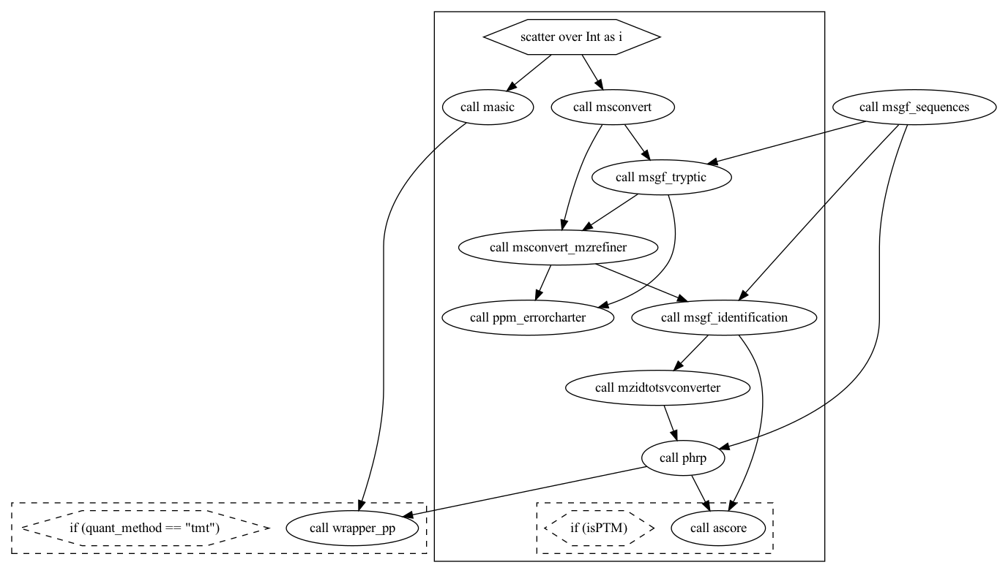

# MSGF+ Pipeline

Workflow of the MSGF+ pipeline



## Overview

| Step | Description                                                                                                                       | Software                      | Input                                         | Output                                                         | 
|------|-----------------------------------------------------------------------------------------------------------------------------------|-------------------------------|-----------------------------------------------|----------------------------------------------------------------|
| 00   | Extract reporter ion peaks from MS2 spectra and create Selected Ion Chromatograms for each MS/MS parent ion                       | MASIC                         | Thermo .Raw file                              | _ReporterIons.txt and _SICStats.txt (plus several other files) |
| 01   | Convert Thermo .raw files to .mzML files (standard XML file format for MS data)                                                   | MSConvert                     | Thermo .Raw file                              | .mzML file                                                     |
| 02   | Identify peptides using a fully tryptic search (for speed); these are used in Step 03                                             | MS-GF+                        | .mzML file and .fasta file                    | .mzid file                                                     |
| 03a  | Use mass error histograms to in-silico re-calibrate the m/z values in the .mzML file                                              | mzrefiner filter in MSConvert | .mzid file and .mzML file                     | _FIXED.mzML                                                    |
| 03b  | Plot the mass error histograms before and after in-silico recalibration                                                           | PPMErrorCharter               | .mzid file and _FIXED.mzML file               | PNG files                                                      |
| 04   | Identify peptides using a partially tryptic search                                                                                | MS-GF+                        | _FIXED.mzML file and .fasta file              | .mzid file                                                     |
| 05   | Create a tab-separated value file listing peptide IDs from step 04                                                                | MzidToTSVConverter            | .mzid file                                    | .tsv file                                                      |
| 06   | Create tab-delimited files required for step 7; files contain peptide IDs, unique sequence info, and residue modification details | PeptideHitResultsProcessor    | .tsv file                                     | _syn.txt file and several related files                        |
| 07   | Localize the position of Phosphorylation on S, T, and Y residues in phosphopeptides                                               | Ascore                        | _syn.txt files, _FIXED.mzML file, .fasta file | _syn_plus_ascore.txt file                                      |


## Details

All the steps described here can be run in the containers available in the [dockerfiles](../dockerfiles/) directory. Check the [docker_readme.md](../dockerfiles/docker_readme.md) to find out more. 

The examples are based on the analysis of both protein global abundance and a post-translational modification (protein phosphorylation). 

The commands available in every step are extracted from the [WDL file](../wdl/proteomics_msgfplus.wdl). The variables between `${ }` refers to the input, outputs, and parameter files. The names are self-explanatory. For example, `${raw_file}` refers to a single raw file.


### Step 00: MASIC

Extract reporter ion peaks from MS2 spectra and create Selected Ion Chromatograms for each MS/MS parent ion.

Container: `prot-masic`

```
mono /app/masic/MASIC_Console.exe \
/I:${raw_file} \
/P:${masic_parameter} \
/O:output_masic
```


### Step 1: Convert `.raw` to `.mzML` files

Convert Thermo .raw files to .mzML files (standard XML file format for MS data)

- Input: `raw/*.raw`
- Output: `msgfplus_input/*.mzML`

Container: `docker.io/chambm/pwiz-skyline-i-agree-to-the-vendor-licenses:3.0.22132-3ed3ab4`

```
wine msconvert ${raw_file} \
--zlib \
--filter "peakPicking true 2-" \
-o output_msconvert
```

### Step 2: Identify peptides using a fully tryptic search

Run on Docker MS-GF+ (`prot-msgfplus`) using the `.mzML` file from `msconvert` (step 1), get a `.mzid` file

- Input directory/files:
  + `*.mzML`
  +  `sequence_db.fasta` sequence db
  +  `MSGFPlus_Mods.txt` config file
- Output directory/file: `msgfplus_output/*.mzid`

Container: `prot-msgfplus`

```
java -Xmx4000M \
-jar /app/MSGFPlus.jar \
-s ${input_mzml} \
-o output_msgf_tryptic/${sample_id}.mzid \
-d ${seq_file_id}.fasta \
-conf ${msgf_tryptic_mzrefinery_parameter}
```

### Step 3: Use mass error histograms to in-silico re-calibrate the m/z values

#### 3A) `mzrefiner` filter in `MSConvert`

Use mass error histograms to in-silico re-calibrate the m/z values in the `.mzML` file. 
Run `msconvert` with the mzrefiner option to create a new `.mzML` file named `_FIXED.mzML`

Container: `prot-msgfplus`

```
wine msconvert ${input_mzml} \
-o output_msconvert_mzrefiner \
--outfile output_msconvert_mzrefiner/${output_name} \
--filter "mzRefiner ${input_mzid} thresholdValue=-1e-10 thresholdStep=10 maxSteps=2" \
--zlib
```

#### 3B) `PPMErrorCharter`

Run `PPMErrorCharter` using the `.mzid` file from step 2a and the `_FIXED.mzML` file from step 3a

Container: `prot-ppmerror`

```
mono /app/PPMErrorCharterPython.exe \
-I:${input_mzid} \
-F:${input_fixed_mzml} \
-EValue:1E-10 \
-HistogramPlot:output_ppm_errorcharter/${sample_id}-histograms.png \
-MassErrorPlot:output_ppm_errorcharter/${sample_id}-masserrors.png \
-Python
```
 
### Step 4: Protein Identification and Quantification

Identify peptides using a partially tryptic search

Run MS-GF+ using the `_FIXED.mzml` file from Step 3: That creates a `.mzID` file (called it `Dataset_final.mzid`). 

Container: `prot-msgfplus`

```
java -Xmx4000M \
-jar /app/MSGFPlus.jar \
-s ${sample_id}.mzML \
-o output_msgf_identification/${sample_id}_final.mzid \
-d ${seq_file_id}.fasta \
-conf ${msgf_identification_parameter}
```


### Step 5: `MzidToTSVConverter`

Create a tab-separated value file listing peptide IDs from step 04. 

Run `MzidToTSVConverter` to convert `Dataset_final.mzid` to `Dataset.tsv`

Container: `prot-mzid2tsv`

```
mono /app/mzid2tsv/net462/MzidToTsvConverter.exe \
-mzid:${input_mzid_final} \
-tsv:output_mzidtotsvconverter/${output_name} \
-unroll -showDecoy
```

### Step 6: `PeptideHitResultsProcRunner`

Create tab-delimited files required for step 7; files contain peptide IDs, unique sequence info, and residue modification details 

Run `PeptideHitResultsProcRunner` using the `.tsv` file from step 5

Container: `prot-phrp`

```
mono /app/phrp/PeptideHitResultsProcRunner.exe \
-I:${input_tsv} \
-O:output_phrp \
-M:${phrp_parameter_m} \
-T:${phrp_parameter_t} \
-N:${phrp_parameter_n} \
-SynPvalue:${phrp_synpvalue} \
-SynProb:${phrp_synprob} \
-L:output_phrp/${phrp_logfile} \
-ProteinMods \
-F:${input_revcat_fasta}
```


### Step 7: AScore (only PTMs)

Localize the position of Phosphorylation on S, T, and Y residues in phosphopeptides.

Inputs: `_syn.txt`, `_FIXED.mzML`, `.fasta` files 

Container: `prot-ascore`

```
mono /app/ascore/AScore_Console.exe \
-T:msgfplus \
-F:${input_syn} \
-D:${input_fixed_mzml} \
-MS:${syn_ModSummary} \
-P:${ascore_parameter_p} \
-U:${seq_file_id}_syn_plus_ascore.txt \
-O:output_ascore \
-Fasta:${fasta_sequence_db} \
-L:output_ascore/${ascore_logfile}
```


### Step 8: Relative Quantification

Step for processing TMT data proteomics data using [PlexedPiper](https://github.com/PNNL-Comp-Mass-Spec/PlexedPiper) and generate reporter ion intensity and ratio tables.

Inputs: 
- MS/MS identifications from the MS-GF+ search engine
- Reporter ion intensities extracted using MASIC
- Tables outlining study design
   + table linking dataset to plexes
   + table linking reporter channels with sample names
   + table identifying reference within each plex

Script to run PlexedPiper: [`pp.R`](../scripts/pp.R)

Container: `prot-plexedpiper`


```
Rscript /app/pp.R \
-p ${proteomics_experiment} \
-i final_output_phrp \
-j final_output_masic \
-f ${fasta_sequence_db} \
-d ${sequence_db_name} \
-s study_design \
-o output_plexedpiper \
-n ${results_prefix} \
-c "${species}" \
-u ${unique_only} \
-r ${refine_prior}
```


